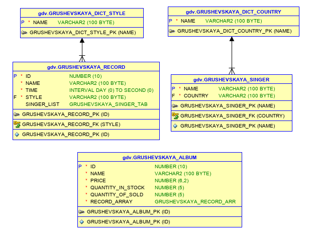

## БД «Музыкальный магазин»

Дисциплина "Объектные базы данных", ЯрГУ 2020г

## Объекты
* запись (идентификатор, название, время звучания, стиль);
* альбом (идентификатор, название, стоимость, количество на складе, количество проданных экземпляров);
* исполнитель (имя, псевдоним или название группы; страна).

Для каждого альбома должен быть указан список треков с указанием порядкового номера для каждой записи; одна запись может входить в разные альбомы; один трек также может быть записан сразу несколькими исполнителями. В каждом альбоме не более 30 записей. 

## Методы

### Минимальный функционал: 
1) добавить запись (изначально указывается один исполнитель); 
2) добавить исполнителя для записи (если указанная запись не добавлена ни в один альбом); 
3) добавить исполнителя;
4) добавить альбом (изначально указывается один трек или ни одного); 
5) добавить трек в альбом (если не продано ни одного экземпляра); 
6) список альбомов в продаже (количество на складе больше 0); 
7) список исполнителей; 
8) поставка альбома (количество на складе увеличивается на указанное значение); 
9) продать альбом (количество на складе уменьшается, проданных – увеличивается; продать можно только альбомы, в которых есть хотя бы один трек). 
10) удалить исполнителей, у которых нет ни одной записи.

### Основной функционал: 
11) трек-лист указанного альбома с указанием суммарного времени звучания альбома; 
12) выручка магазина (суммарная стоимость проданных альбомов по каждому в отдельности и по магазину в целом); 
13) удалить трек с указанным номером из альбома с пересчётом остальных номеров (если не продано ни одного экземпляра альбома); 
14) удалить исполнителя из записи (если запись не входит ни в один альбом и если этот исполнитель не единственный); 
15) определить предпочитаемый музыкальный стиль указанного исполнителя (стиль, в котором записано большинство его треков). 
16) определить предпочитаемый музыкальный стиль по каждой стране происхождения исполнителей; 
17) определить авторство альбомов (для каждого альбома выводится исполнитель или список исполнителей, если все треки этого альбома записаны одним множеством исполнителей; в противном случае выводится «Коллективный сборник»).

##  Схема БД

    

## Отчет

[Отчет по работе](ГрушевскаяДВ_ИТ-11МО_Отчет.pdf)
